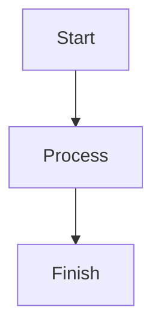

## 🛠 Contributing to the Documentation

Welcome! We use **MkDocs** with the **Material** theme and the **Multirepo** plugin to build our documentation. Follow these steps to set up your environment and contribute.

### 1. Prerequisites

You need **Python** installed. Check your version:

```bash
python --version

```

### 2. Installation & Environment Setup

We use a virtual environment to keep dependencies isolated and ensure plugins like `multirepo` work correctly.

```bash
# 1. Clone the repository
git clone <your-repo-url>
cd <repo-name>

# 2. Create a virtual environment
# On Windows: python -m venv venv
# On macOS/Linux: python3 -m venv venv
python -m venv venv

# 3. Activate the environment
# On Windows:
.\venv\Scripts\activate
# On macOS/Linux:
source venv/bin/activate

# 4. Install all required dependencies
pip install mkdocs-material mkdocs-multirepo-plugin mkdocstrings[python] pymdown-extensions

```

### 3. Local Development

To see your changes in real-time, start the development server. **Note:** Ensure your virtual environment is active (you should see `(venv)` in your terminal prompt).

```bash
mkdocs serve

```

Once started, open your browser to **`http://127.0.0.1:8000`**. The page will automatically refresh whenever you save a file.

---

## 📝 How to Add or Edit Pages

MkDocs uses a simple structure: all content lives in the `docs/` folder, and the navigation is managed in `mkdocs.yml`.

### Step 1: Create the Markdown file

Add a new `.md` file inside the `docs/` directory. For example, to add a "Setup Guide":

* Path: `docs/setup-guide.md`
* Content: Use standard Markdown syntax.

### Step 2: Register the page in `mkdocs.yml`

MkDocs won't show your page in the sidebar unless you add it to the `nav` section of your configuration file.

```yaml
site_name: My Project Docs
theme:
  name: material

nav:
  - Home: index.md
  - User Guide:
      - Installation: installation.md
      - Setup Guide: setup-guide.md  # <--- Add your new page here
  - Contributing: contributing.md

```

### Step 3: Formatting Tips

* **Admonitions:** Great for highlights.
```markdown
!!! note
    This is a helpful tip for contributors.

```

* **Mermaid Diagrams:** Create flowcharts directly in Markdown:



* **Links:** Use relative paths to link between pages.
`Check out the [Installation Guide](installation.md).`

---

## 🚀 Submitting Your Changes

1. **Branch:** Create a new branch for your changes (`git checkout -b docs/add-setup-guide`).
2. **Lint:** Ensure there are no broken links by running `mkdocs build`.
3. **PR:** Commit your changes and open a Pull Request!

---

## 📚 Writing Resources

To keep our documentation clean and professional, please follow standard Markdown syntax. If you are new to Markdown or need a refresher on advanced formatting, use the following guide:

### Recommended Guide

We recommend using the **[Markdown Guide](https://www.markdownguide.org/basic-syntax/)**. It provides a comprehensive look at:

* **Basic Syntax:** Headers, lists, and code blocks.
* **Extended Syntax:** Tables, task lists, and footnotes.
* **Cheat Sheet:** A quick reference for when you're in a flow.

---

## 🎨 MkDocs Specific Formatting

Since we use the **Material for MkDocs** theme, you also have access to some "SuperFences" and special UI elements. You can find the specific documentation for those here:

* **[Material Design Icons](https://squidfunk.github.io/mkdocs-material/reference/icons-emojis/):** How to add icons directly into your text.
* **[Content Tabs](https://squidfunk.github.io/mkdocs-material/reference/content-tabs/):** Great for showing code examples in multiple languages (e.g., Python vs. JavaScript).

> **Pro-Tip:** If you want to see how a specific page on our site was written, you can usually find the "Edit this page" button (the pencil icon) at the top right of any page to view the raw Markdown source.
