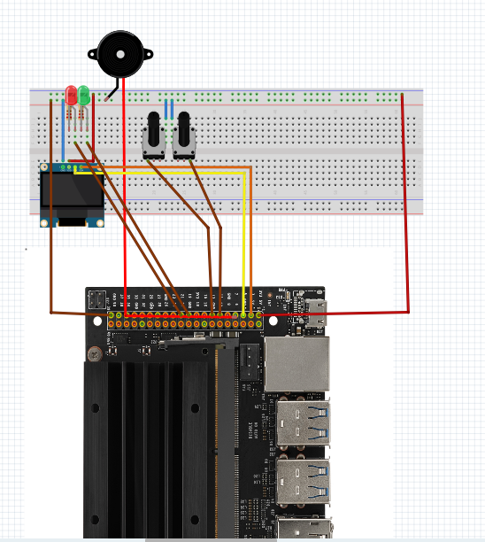

# Status Board
This module serves as the primary interface for the autonomous RC car, providing real-time telemetry via an OLED display, status indicators via LEDs, and emergency/status alerts via a piezo buzzer.

### **1. Electronic Parts List**

The following components are required for this build:

| Item | Component | Quantity | Purpose |
| --- | --- | --- | --- |
| **1** | **Single Board Computer (SBC)** | 1 | Main controller (Jetson Nano / Raspberry Pi style). |
| **2** | **I2C OLED Display (SSD1306)** | 1 | Displays speed, battery level, and sensor data. |
| **3** | **Push Buttons / Toggle Switches** | 2 | Manual input (e.g., Mode Select, Start/Stop). |
| **4** | **Active/Passive Buzzer** | 1 | Audible error alerts and status pings. |
| **5** | **LEDs (Red & Green)** | 2 | Visual status (Green = Ready, Red = Error/Braking). |
| **6** | **Resistors (220Ω - 330Ω)** | 2 | Current limiting for the LEDs. |
| **7** | **Breadboard & Jumper Wires** | 1 set | For prototyping connections. |

---

### **2. Connection Map (Wiring Schema)**

#### **A. Power & Ground (Bus Lines)**

* **VCC (3.3V/5V):** Connected from the SBC power rail to the breadboard positive rail (Red wire).
* **GND (Ground):** Connected from the SBC GND pin to the breadboard negative rail (Brown/Black wire).

#### **B. Display (I2C Interface)**

The OLED screen uses the I2C protocol for communication.

* **VCC/GND:** Connected to the power rails.
* **SCL (Clock):** Yellow wire connected to the SBC I2C SCL pin.
* **SDA (Data):** Green wire connected to the SBC I2C SDA pin.

#### **C. Input Switches**

The switches provide manual control to the car's logic.

* **Switch 1:** Connected to a GPIO pin via the orange/brown wire.
* **Switch 2:** Connected to a GPIO pin via the orange/brown wire.
* *Note: These appear to be pulled to the GND rail when closed.*

#### **D. Status Indicators (LEDs & Buzzer)**

* **Green LED:** Connected to a GPIO pin through a resistor; indicates "System Healthy" or "Autonomous Mode Active."
* **Red LED:** Connected to a GPIO pin through a resistor; indicates "Obstacle Detected" or "System Error."
* **Buzzer:** The red wire connects to a PWM-capable GPIO pin for generating alert tones.

---

### **3. Implementation Notes**

* **I2C Configuration:** Ensure I2C is enabled in the SBC system settings (`raspi-config` or `jetson-io.py`) to communicate with the OLED.
* **Resistor Placement:** Ensure resistors are in series with the LEDs to prevent burning out the GPIO pins of your controller.
* **Logic Levels:** Verify if your SBC uses 3.3V or 5V logic. Most modern boards (Jetson/Pi) use **3.3V**; ensure your OLED and sensors are compatible.

## 🔌 Wiring & Pinout Mapping

The following table maps the physical connections from the **Jetson Orin Nano 40-pin Header** to the breadboard components as seen in the schematic.

### **Jetson Orin Nano Connection Table**

| Component Pin | Wire Color (Diagram) | Jetson GPIO / Pin | Function |
| --- | --- | --- | --- |
| **VCC (Rail)** | Red | **Pin 2 or 4 (5V)** | System Power |
| **GND (Rail)** | Brown | **Pin 6, 9, or 14** | Common Ground |
| **OLED SCL** | Yellow | **Pin 5 (I2C_2_SCL)** | I2C Clock |
| **OLED SDA** | Yellow/Green | **Pin 3 (I2C_2_SDA)** | I2C Data |
| **Buzzer (+)** | Red | **Pin 7 (PWM)** | Alert Tones (PWM controlled) |
| **LED (Green)** | Brown | **Pin 19 (GPIO)** | Status Indicator |
| **LED (Red)** | Brown | **Pin 21 (GPIO)** | Error Indicator |
| **Switch 1** | Orange | **Pin 11 (GPIO)** | Mode Selection |
| **Switch 2** | Orange | **Pin 13 (GPIO)** | Start/Stop Command |

> [!IMPORTANT]
> It need to be configured these pins using the `jetson-io.py` tool to enable **PWM** on Pin 33 and **I2C** on Pins 3/5.

---

## 💻 Software Integration (ROS 2)

To interface with these components, the car runs a dedicated `hmi_node` within the ROS 2 workspace.

### **Logic Flow**

1. **OLED:** Subscribes to `/odometry` and `/battery_status` topics.
2. **LEDs:** Controlled via the `/diagnostics` topic.
3. **Buttons:** Publish to `/cmd_mode` to switch between Reinforcement Learning (Autonomous) and Teleop (Manual) modes.
