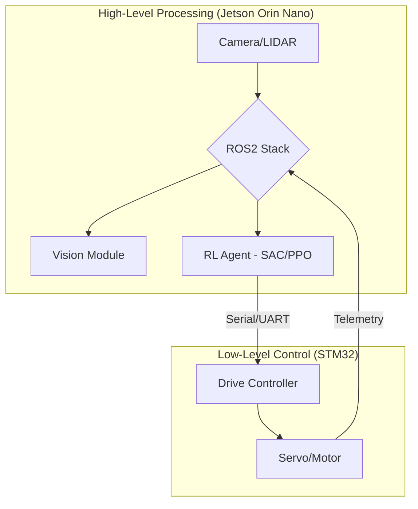

# TAVP: TED Autonomous Vehicle Project

Welcome to the central documentation hub for **TAVP**. This project aims to develop a 1/10th scale autonomous racing car capable of navigating complex environments using Reinforcement Learning and Computer Vision.

## 🏎 Project Vision
Our goal is to implement a robust autonomous stack on a Husqvarna Svartpilen-inspired RC platform, utilizing the **NVIDIA Jetson Orin Nano** for high-level AI and **STM32** for low-level real-time control.

## 🏗 System Overview

